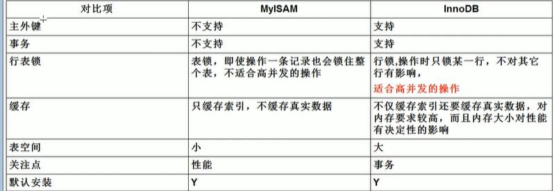

### mysql的逻辑结构
1.连接层 、服务层、引擎层、存储层
### 存储引擎
1.InnoDB MyISAM  


### SQL性能下降的原因
1.sql语句烂
2.索引失效
3.Join
4.服务器优化
### SQL执行的加载顺序
from -> where -> join on -> group by -> having -> select -> distinct -> orderby -> limit
### 7种Join理论
```
1.select * from tableA A left join tableB B on A.id = B.id where B.id = null
2.select * from tableA A full outer join tableB B on A.id = B.id 全连接（mysql不存在这种语法）
select * from tableA A left Join tableB B on A.id = B.id union select * from tableA A right Join tableB B on A.id = B.id (union自带去重，union all则没有去重)
3.select * from tableA A full outer join tableB B on A.id = B.id where A.id = null or B.id = null（mysql不存在这种语法）
select * from tableA A left Join tableB B on A.id = B.id where B.id = null union select * from tableA A right Join tableB B on A.id = B.id where A.id = null
```
### 索引
#### 什么是索引
```
索引是一种排好序的数据结构

```
#### 为什么要用索引？
```
提高查找效率，降低IO，CPU损耗，eg 新华字典的目录，
```
#### 索引的缺点
索引是一张表，保存了主键与索引字段，并指向实体表的记录，占据空间  
每次更新表都要更新索引
#### 什么情况适合加索引？什么时候不适合
#### 性能瓶颈
1. CPU饱和
2. IO 
3. 服务器硬件
### explain（能干嘛）
1.表的读取顺序
2.数据读取操作的操作类型
3.哪些索引可以使用
4.哪些索引被实际使用
5.表之间的引用
6.每张表有多少行被优化器查询

### 避免索引失效
1.全值匹配
2.最佳左前缀法则
3.不再索引列上做任何操作（计算、函数、自动或手动类型转换）
4.存储引擎不能使用索引中范围条件右边的列
5.尽量使用覆盖索引
6.mysql在使用不等于时无法使用索引
7.is null ，is not null无法使用索引
8.like 以%开头索引失效
避免like以%开头索引失效可以通过覆盖索引
10.字符串不加单引号索引失效
11.少用or，用它来连接时会索引失效
